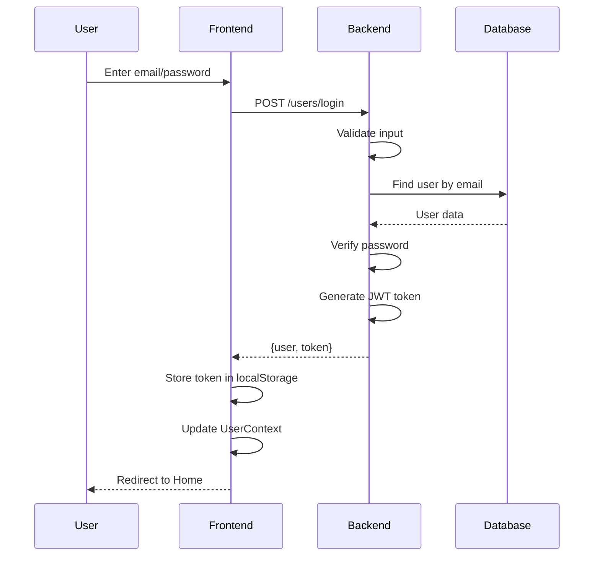
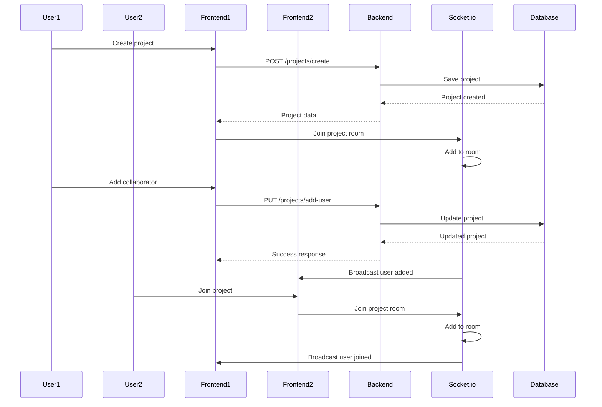
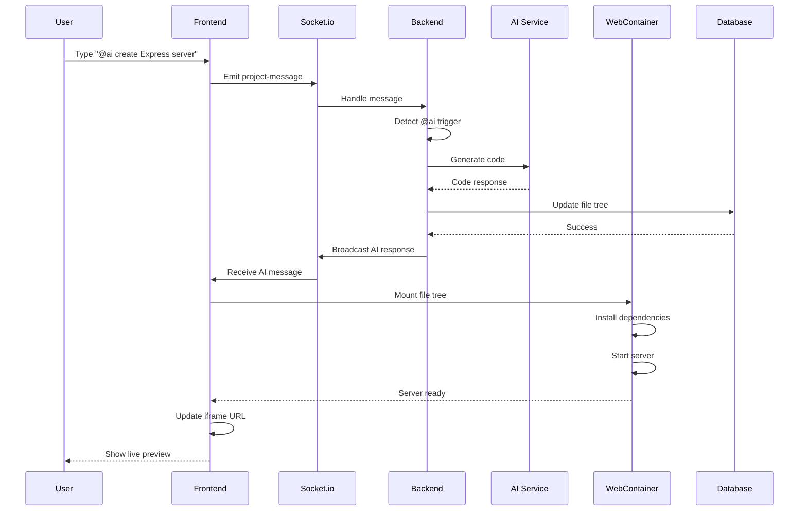
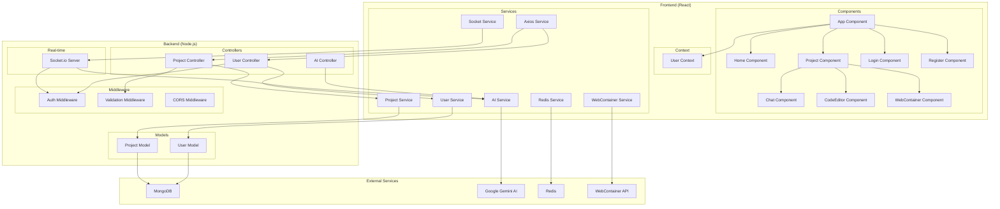
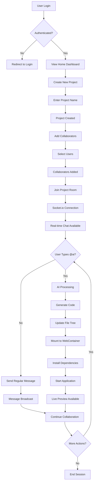
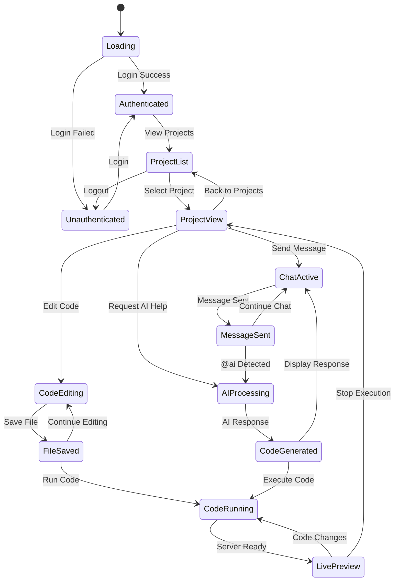
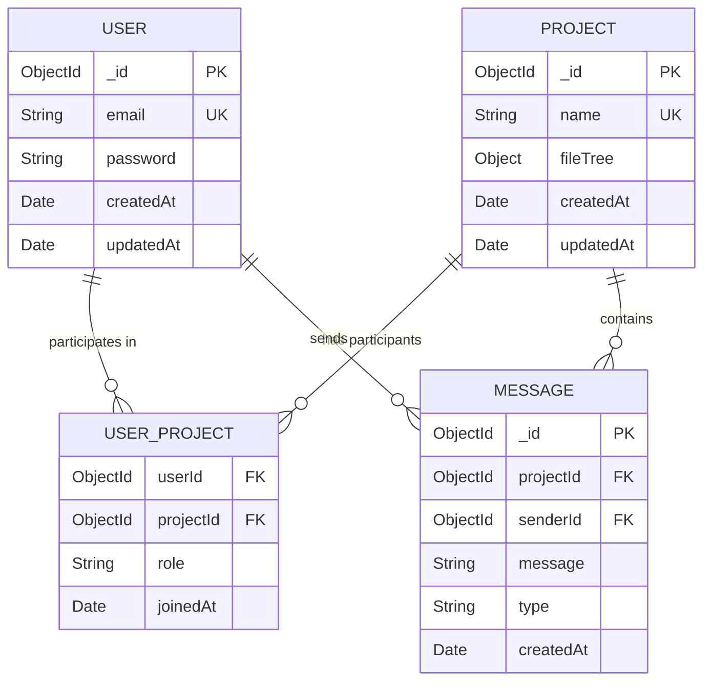
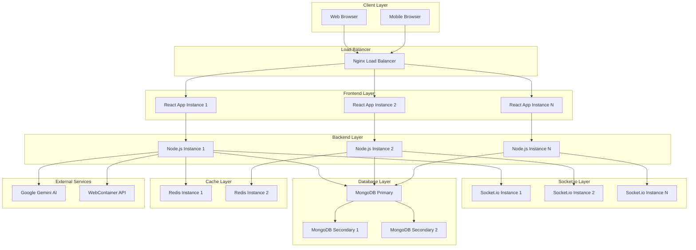

# ChatNova - UML Diagrams

## 1. Class Diagram

```mermaid
classDiagram
    class User {
        +String email
        +String password
        +Date createdAt
        +Date updatedAt
        +generateToken() String
        +isValidPassword(password) Boolean
        +hashedPassword(password) String
    }

    class Project {
        +String name
        +Array users
        +Object fileTree
        +Date createdAt
        +Date updatedAt
        +addUser(userId) void
        +removeUser(userId) void
        +updateFileTree(fileTree) void
    }

    class UserController {
        +createUserController(req, res) void
        +loginUserController(req, res) void
        +profileController(req, res) void
    }

    class ProjectController {
        +createProject(req, res) void
        +getAllProject(req, res) void
        +addUserToProject(req, res) void
        +getProjectById(req, res) void
        +updateFileTree(req, res) void
    }

    class UserService {
        +createUser(userData) User
        +findUserByEmail(email) User
        +validateUser(email, password) Boolean
    }

    class ProjectService {
        +createProject(projectData) Project
        +getAllProjectByUserId(userId) Array
        +addUsersToProject(projectData) Project
        +getProjectById(projectId) Project
        +updateFileTree(projectData) Project
    }

    class AIService {
        +GoogleGenerativeAI genAI
        +generateResult(prompt) String
        +parseAIResponse(response) Object
    }

    class WebContainerService {
        +WebContainer container
        +initialize() WebContainer
        +mountFileTree(fileTree) void
        +runCommand(command, args) Process
        +spawnProcess(command, args) Process
    }

    class SocketManager {
        +Server io
        +handleConnection(socket) void
        +handleMessage(socket, data) void
        +handleAIRequest(socket, prompt) void
        +broadcastToRoom(roomId, event, data) void
    }

    class AuthMiddleware {
        +authCheck(req, res, next) void
        +validateToken(token) Object
        +extractToken(req) String
    }

    class ValidationMiddleware {
        +validateUser(req, res, next) void
        +validateProject(req, res, next) void
        +handleValidationErrors(errors) void
    }

    class UserContext {
        +User user
        +setUser(user) void
        +logout() void
        +isAuthenticated() Boolean
    }

    class ProjectComponent {
        +Project project
        +Array messages
        +Object fileTree
        +String currentFile
        +Array openFiles
        +WebContainer webContainer
        +String iframeUrl
        +sendMessage(message) void
        +updateFileTree(fileTree) void
        +runCode() void
    }

    class ChatComponent {
        +Array messages
        +String message
        +sendMessage() void
        +receiveMessage(data) void
        +scrollToBottom() void
    }

    class CodeEditorComponent {
        +Object fileTree
        +String currentFile
        +Array openFiles
        +updateFile(fileName, content) void
        +saveFileTree() void
        +highlightSyntax(code, language) String
    }

    class WebContainerComponent {
        +WebContainer container
        +String iframeUrl
        +Process runProcess
        +initializeContainer() void
        +mountFileTree(fileTree) void
        +runCommand(command, args) void
        +handleServerReady(port, url) void
    }

    %% Relationships
    User ||--o{ Project : "collaborates on"
    UserController --> UserService : "uses"
    ProjectController --> ProjectService : "uses"
    UserService --> User : "manages"
    ProjectService --> Project : "manages"
    ProjectService --> User : "references"
    AIService --> WebContainerService : "generates for"
    SocketManager --> AIService : "triggers"
    SocketManager --> ProjectService : "updates"
    AuthMiddleware --> User : "validates"
    ValidationMiddleware --> UserController : "validates"
    ValidationMiddleware --> ProjectController : "validates"
    UserContext --> User : "manages"
    ProjectComponent --> ChatComponent : "contains"
    ProjectComponent --> CodeEditorComponent : "contains"
    ProjectComponent --> WebContainerComponent : "contains"
    ChatComponent --> SocketManager : "communicates with"
    CodeEditorComponent --> ProjectService : "saves to"
    WebContainerComponent --> WebContainerService : "uses"
```

## 2. Sequence Diagram - User Authentication Flow



## 3. Sequence Diagram - Project Creation and Collaboration



## 4. Sequence Diagram - AI Code Generation and Execution



## 5. Use Case Diagram

```mermaid
graph TB
    subgraph "ChatNova System"
        subgraph "Authentication"
            UC1[Register User]
            UC2[Login User]
            UC3[View Profile]
        end

        subgraph "Project Management"
            UC4[Create Project]
            UC5[View Projects]
            UC6[Add Collaborators]
            UC7[Join Project]
        end

        subgraph "Real-time Collaboration"
            UC8[Send Messages]
            UC9[Receive Messages]
            UC10[Edit Code]
            UC11[View File Tree]
        end

        subgraph "AI Integration"
            UC12[Request AI Help]
            UC13[Generate Code]
            UC14[Get Code Suggestions]
        end

        subgraph "Code Execution"
            UC15[Run Code]
            UC16[View Live Preview]
            UC17[Install Dependencies]
        end
    end

    subgraph "Actors"
        A1[Authenticated User]
        A2[Project Owner]
        A3[Collaborator]
        A4[AI Assistant]
    end

    A1 --> UC1
    A1 --> UC2
    A1 --> UC3
    A1 --> UC4
    A1 --> UC5
    A1 --> UC8
    A1 --> UC9
    A1 --> UC10
    A1 --> UC11
    A1 --> UC12
    A1 --> UC15
    A1 --> UC16

    A2 --> UC6
    A2 --> UC7

    A3 --> UC7
    A3 --> UC8
    A3 --> UC9
    A3 --> UC10
    A3 --> UC11
    A3 --> UC12
    A3 --> UC15
    A3 --> UC16

    A4 --> UC13
    A4 --> UC14
    A4 --> UC17
```



## 6. Component Diagram



## 7. Activity Diagram - Project Collaboration Flow



## 8. State Diagram - Project Component States



## 9. Entity Relationship Diagram (ERD)



## 10. Deployment Architecture Diagram



These UML diagrams provide a comprehensive view of the ChatNova project's architecture, interactions, and data flow. They can be used for:

1. **Technical Documentation** - Understanding system architecture
2. **Development Planning** - Identifying components and relationships
3. **Interview Presentations** - Explaining system design
4. **Code Reviews** - Validating implementation against design
5. **Onboarding** - Helping new developers understand the system

The diagrams cover all major aspects including authentication, real-time communication, AI integration, code execution, and deployment architecture. 