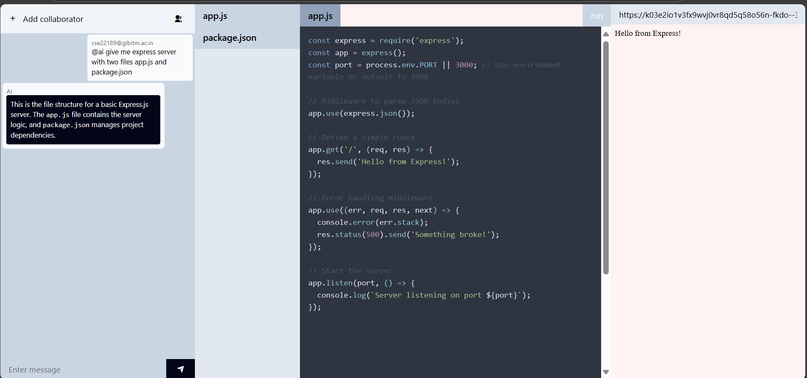

# 🚀 DevSync - AI-Powered Collaborative Development Platform

<div align="center">


**Revolutionary AI-powered collaborative development environment with real-time code execution**

</div>

---

## 🎯 Project Overview

DevSync is a cutting-edge collaborative development platform that combines the power of AI-assisted coding with real-time collaboration and instant code execution. Built with modern web technologies, it provides a seamless development experience where teams can code together, get AI assistance, and see their applications run instantly in a sandboxed environment.

### 🌟 What Makes DevSync Special?

- **🤖 AI-Powered Development**: Integrated Google Gemini AI for intelligent code generation and assistance
- **👥 Real-Time Collaboration**: Multi-user coding sessions with live chat and file synchronization
- **⚡ Instant Code Execution**: WebContainer-powered sandbox for immediate code testing
- **🎨 Modern UI/UX**: Beautiful, responsive interface built with React and Tailwind CSS
- **🔒 Secure Authentication**: JWT-based authentication with bcrypt password hashing
- **📱 Real-Time Communication**: Socket.io for instant messaging and collaboration

---

## 🎬 Demo

### Key Features Showcase

<details>
<summary>🎥 Watch Demo Video</summary>

[Demo Video Link - Coming Soon]

</details>

### Screenshots

<div align="center">

### Login Page


---

### Add Collaborators


---

### AI Support


---

### Node.js Code Execution

---

### Real Time Collaboration


</div>


### Live Demo Features
- **Real-time collaboration** with multiple users
- **AI code generation** using `@ai` commands
- **Instant code execution** in browser sandbox
- **Live chat** with syntax highlighting
- **File tree management** with real-time updates

---

## ✨ Key Features

### 🤖 AI Integration
- **Smart Code Generation**: Ask AI to create entire applications with `@ai` commands
- **Intelligent Assistance**: Get code suggestions, debugging help, and best practices
- **Context-Aware Responses**: AI understands your project structure and provides relevant solutions
- **Markdown Rendering**: Beautiful code formatting with syntax highlighting

### 👥 Collaborative Development
- **Real-Time Multi-User Editing**: Multiple developers can work on the same project simultaneously
- **Live Chat System**: Built-in messaging with AI integration
- **Project Sharing**: Invite team members to collaborate on projects
- **File Tree Management**: Visual file explorer with real-time updates

### ⚡ Code Execution Environment
- **WebContainer Integration**: Run Node.js applications directly in the browser
- **Instant Preview**: See your application running in real-time
- **Sandboxed Environment**: Secure execution without server deployment
- **Package Management**: Automatic npm install and dependency management

### 🔐 Security & Authentication
- **JWT Authentication**: Secure token-based authentication
- **Password Hashing**: bcrypt for secure password storage
- **Protected Routes**: Middleware-based route protection
- **User Management**: Role-based access control

---

## 🛠 Tech Stack

### Frontend
- **React 18.3.1** - Modern UI framework with hooks
- **Vite 6.0.5** - Lightning-fast build tool
- **Tailwind CSS 4.1.10** - Utility-first CSS framework
- **Socket.io Client 4.8.1** - Real-time communication
- **WebContainer API 1.6.1** - Browser-based code execution
- **React Router DOM 7.6.2** - Client-side routing
- **Axios 1.9.0** - HTTP client for API calls
- **Highlight.js 11.11.1** - Syntax highlighting
- **Markdown-to-JSX 7.7.7** - Markdown rendering

### Backend
- **Node.js** - JavaScript runtime
- **Express.js 5.1.0** - Web application framework
- **MongoDB 8.15.1** - NoSQL database
- **Mongoose 8.15.1** - MongoDB object modeling
- **Socket.io 4.8.1** - Real-time bidirectional communication
- **JWT 9.0.2** - JSON Web Token authentication
- **bcrypt 6.0.0** - Password hashing
- **Google Generative AI 0.24.1** - AI integration
- **Redis 5.6.1** - Caching and session management
- **Express Validator 7.2.1** - Input validation
- **Morgan 1.10.0** - HTTP request logger

---

## 🏗 Architecture

```
DevSync/
├── Frontend (React + Vite)
│   ├── Real-time UI with Socket.io
│   ├── WebContainer integration
│   ├── AI-powered chat interface
│   └── Collaborative code editor
├── Backend (Node.js + Express)
│   ├── RESTful API endpoints
│   ├── Socket.io server
│   ├── AI service integration
│   └── Database management
└── Database (MongoDB)
    ├── User management
    ├── Project storage
    └── File tree persistence
```

### 🔄 Data Flow
1. **Authentication**: JWT-based user authentication
2. **Real-time Communication**: Socket.io for instant messaging
3. **AI Processing**: Google Gemini AI for code generation
4. **Code Execution**: WebContainer for sandboxed execution
5. **Data Persistence**: MongoDB for project and user data

### 📊 System Architecture Diagram


---


## 📖 Usage Guide

### 1. Getting Started
1. Register an account or log in
2. Create a new project
3. Invite collaborators (optional)
4. Start coding with AI assistance

### 2. AI-Powered Development
- Type `@ai` followed by your request in the chat
- Examples:
  - `@ai Create a React todo app`
  - `@ai Add authentication to this app`
  - `@ai Debug this error`

### 3. Real-Time Collaboration
- Share your project with team members
- Chat in real-time while coding
- See live updates from collaborators
- Run code instantly in the browser

### 4. Code Execution
- Click "Run" to execute your application
- View the live preview in the iframe
- Debug and iterate quickly

### 5. Advanced Features
- **File Management**: Create, edit, and delete files in real-time
- **Collaborator Management**: Add/remove team members
- **Project Sharing**: Share projects with specific users
- **Code History**: Track changes and revert if needed

---

## 🔧 API Endpoints

### Authentication
- `POST /users/register` - User registration
- `POST /users/login` - User login
- `GET /users/profile` - Get user profile

### Projects
- `POST /projects/create` - Create new project
- `GET /projects/all` - Get user's projects
- `GET /projects/get-project/:id` - Get project details
- `PUT /projects/add-user` - Add collaborators
- `PUT /projects/update-file-tree` - Update project files

### AI Integration
- `GET /ai/get-result` - Get AI-generated code

### WebSocket Events
- `project-message` - Real-time messaging
- `file-update` - File tree updates
- `user-join` - User collaboration events

### API Response Format

```json
{
  "success": true,
  "data": {
    "message": "Operation successful",
    "project": {
      "_id": "project_id",
      "name": "Project Name",
      "users": ["user_ids"],
      "fileTree": {}
    }
  },
  "error": null
}
```

---

## 🎨 UI/UX Features

- **Responsive Design**: Works seamlessly on desktop and mobile
- **Dark/Light Theme**: Modern interface with customizable themes
- **Code Syntax Highlighting**: Beautiful code formatting
- **Real-Time Updates**: Live collaboration indicators
- **Intuitive Navigation**: Easy-to-use project management
- **Accessibility**: WCAG compliant design

---

## 🔒 Security Features

- **JWT Authentication**: Secure token-based authentication
- **Password Hashing**: bcrypt with salt rounds
- **Input Validation**: Express-validator for data sanitization
- **CORS Protection**: Cross-origin resource sharing configuration
- **Rate Limiting**: API request throttling
- **SQL Injection Prevention**: Mongoose ODM protection

---


## 🤝 Contributing

We welcome contributions! Please see our [Contributing Guidelines](CONTRIBUTING.md) for details.

### Development Setup
1. Fork the repository
2. Create a feature branch
3. Make your changes
4. Add tests
5. Submit a pull request

### Code Style
- Follow ESLint configuration
- Use Prettier for formatting
- Write meaningful commit messages
- Add tests for new features

---
## 🙏 Acknowledgments

- **Google Generative AI** for providing the AI capabilities
- **WebContainer** for browser-based code execution
- **Socket.io** for real-time communication
- **Tailwind CSS** for the beautiful UI components
- **Vite** for the lightning-fast development experience

